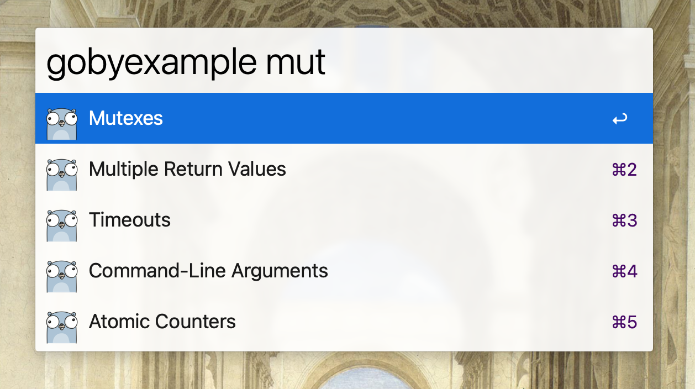

# gobyexample.com Alfred 4 Workflow

## Installation

[Download the workflow from the releases page](https://github.com/alfonmga/gobyexample-alfred-workflow/releases/latest) and install it by double-clicking it.
